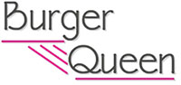
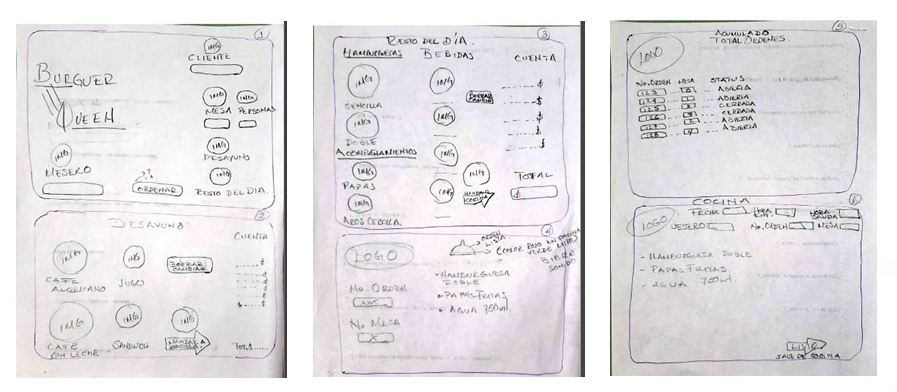
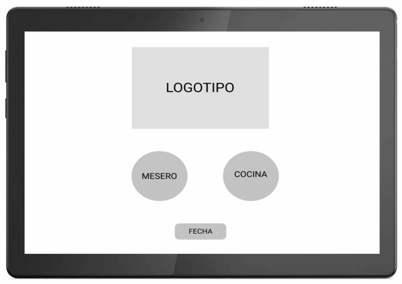
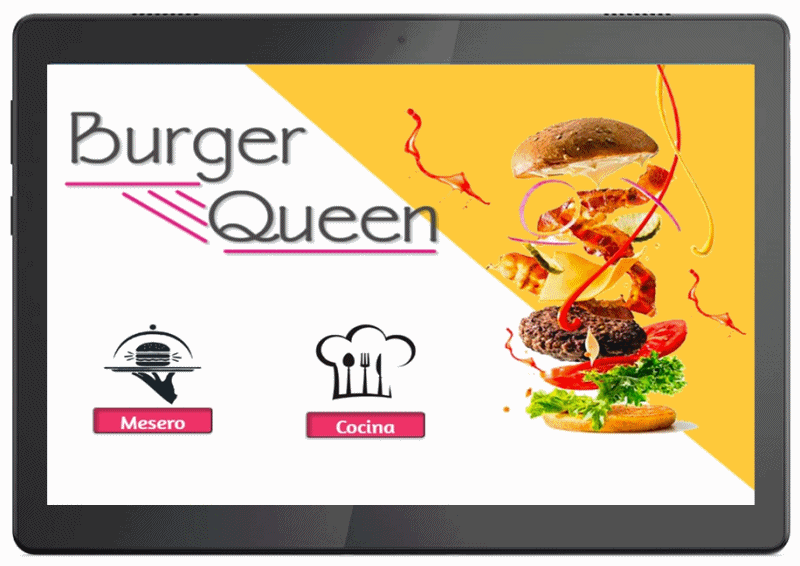
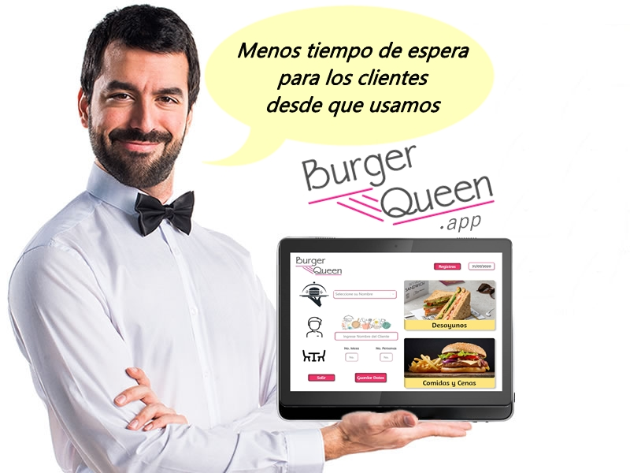

El nombre de la aplicación es:    
    
  
*Cocinar es amor*

> Un restaurante que en esta ocasión tiene por nombre Burger Queen que recién quiere implementar técnología en su recinto, nos pasa un requerimiento en este caso quiere que realicemos una app usando una tablet para facilitar la comunicación entre cocina y meseros.

** __SI  QUIERES VER CÓMO FUNCIONA LA APP ENTRA A ESTE LINK:__ 
 
Debes tener en cuenta que la app por el momento está diseñada para **IPAD-PRO**, por lo que cuando entres al link da click al boton derecho, seleccionas inspeccionar y en el select que dice RESPONSIVE selecciona **IPAD-PRO**.
 
  https://esthermanrique.github.io/CDMX009-BurgerQueen

**La finalidad de la aplicación**

 Es hacer el proceso de los pedidos más eficiente y por lo tanto menos tiempo de espera para los clientes, así como una comunicación más ágil entre _**cocineros y meseros**._
 
 **Desarrollo y planificación de la app**
 
**1-** Realizamos un boceto a lápiz y papel de la idea general de lo que queríamos que se convirtiera nuestra aplicación.
  
#SKETCH
  

**2-** Con la aplicación para proyectos de diseño *FIGMA*, iniciamos realizando la versión esquemática de lo que fue nuestro sketch, planeando así previamente la estructura y los elementos de la página web.
  
#WIREFRAME
  

**3-** Fue el diseño final de lo que sería *Burger-Queen app* donde definimos paleta de colores, tipografía y en general el flujo de navegación de la aplicación. De esta manera poder tener una visión más detallada, precisa y global de los contenidos necesarios plasmando así el resultado final de una versión simulada en alta fidelidad.
  
#PROTOTIPO
  

**Test de usabilidad con usuarios target**

 Al inicio del diseño de la aplicacion construimos una idea de acuerdo a nuestras creencias y creyendo que habíamos tomando buenas decisiones sin embargo al recibir los comentarios de parte de los usuarios a quien le solicitamos el testeo de usabilidad de la app, tomando en cuenta sus recomendaciones decidimos aplicar mejoras, volviendo a solicitar feedback y dejando al usuario satisfecho con lo que implementamos en la app.

 **¿Cómo funciona la app?**
 
 _Tendrá dos secciones:_
 
 >La primera es para el área de los meseros, en donde podrán entrar a su turno, al momento de atender tendrán opción para ingresar su nombre, número de mesa, de clientes y de esta manera tomar pedidos, poder enviar lo que el cliente pidió a cocina y llevar el orden de los pagos, mesas atendidas y en espera.
 
 >La segunda es para el área de cocina en donde los cocineros podrán visualizar en una tabla la orden que entró, con la data del pedido, podrán ver la comanda de preparación y notificarle al mesero cuando el platillo ya está preparado.
 

 
 **Herramientas y tecnologías usadas en la app**
 
 |  **Herramientas y tecnologías usadas en la app**     | 
| :-------------: |
|Figma |
| HTML | 
| CSS |
|Bootstrap|
| Javascript|
|React JS|
|Firebase (Firestore)|
|Git & Github (Projects -Issues- Labels)|
