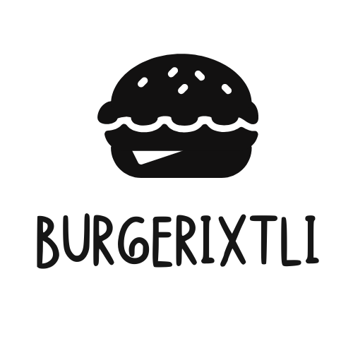
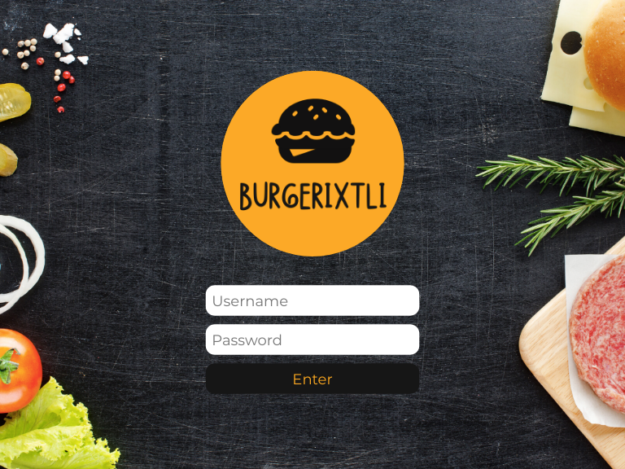
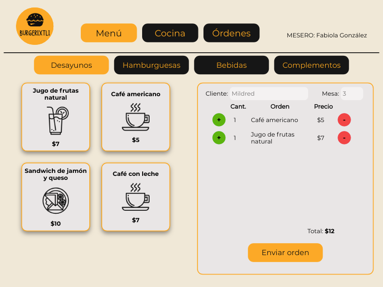
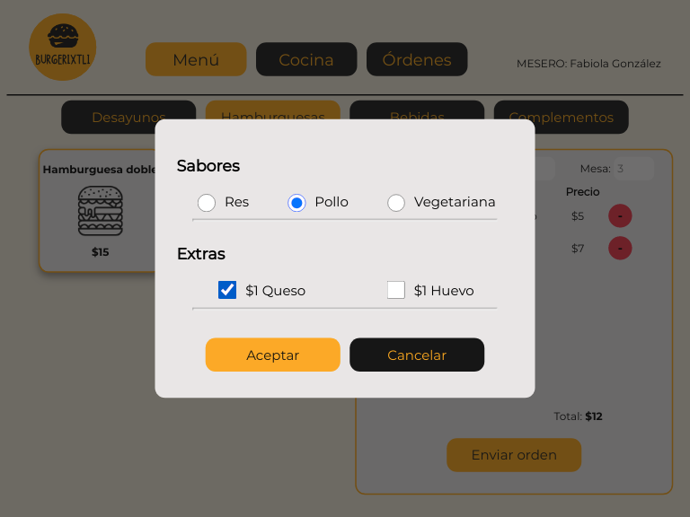
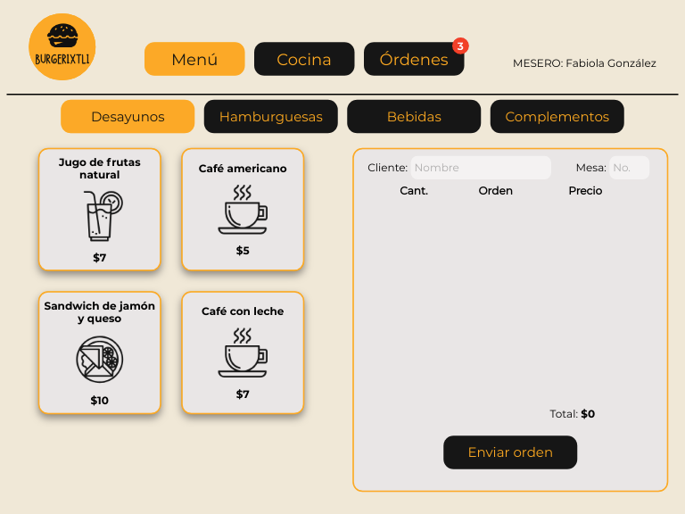
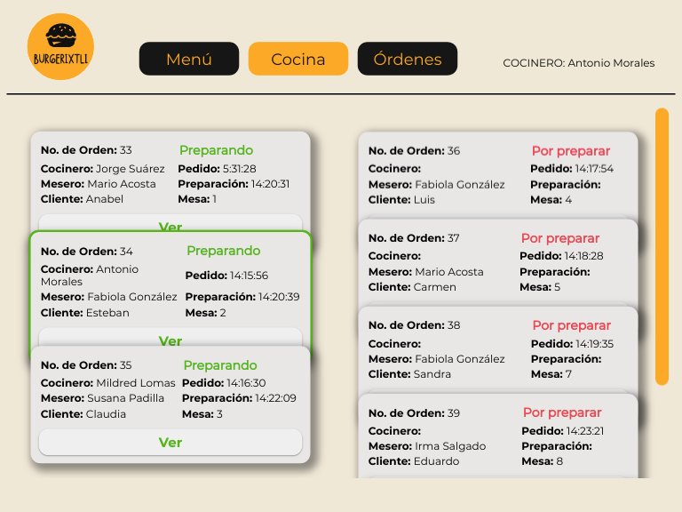
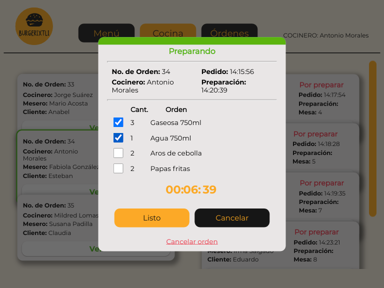
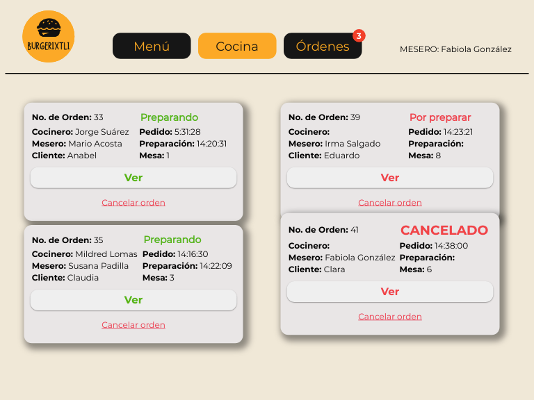
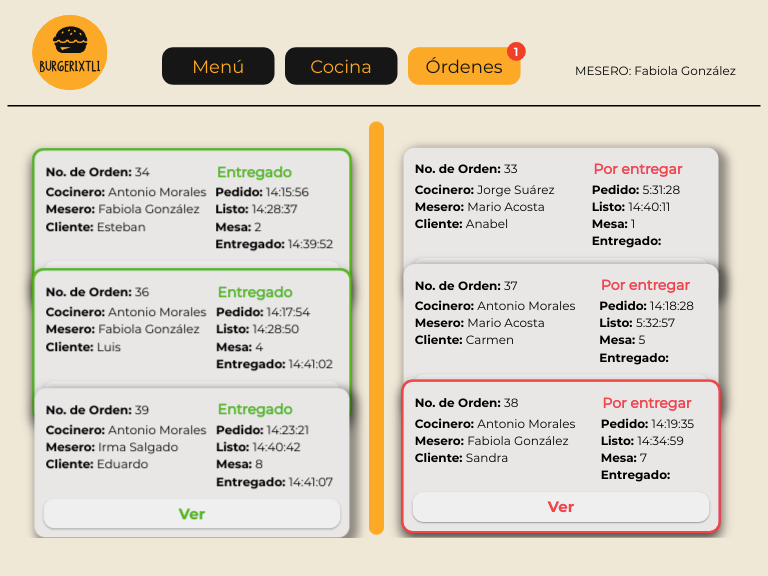
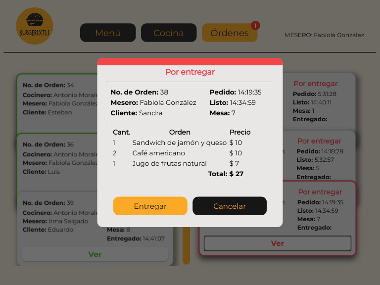

# Proyecto: BurgerIxtli

BurgerIxtli es una single page application (**SPA**) desarrollada para un restaurante 24 horas de comida rápida. Esta construída para dos roles de empleados, el mesero y el cocinero. Gestiona el pedido, la preparación y la entrega de alimentos a los comensales disminuyendo los tiempos de logística dentro del establecimiento. 

Demo: https://burger-queen-e24cd.web.app/

## Desarrollo

Esta aplicación fue diseñada para usarse en un dispositivo tablet y está desarrollada con HTML, CSS, SASS, JavaScript y REACT, así como Firebase para la implementación de la base de datos.

### Mockup

 
## Criterios de aceptación del proyecto

### Definición del producto

El [_Product Owner_](https://www.youtube.com/watch?v=r2hU7MVIzxs&t=202s) presenta este _backlog_ que es el resultado de su trabajo con el cliente hasta hoy.

---

#### [Historia de usuario 1] Mesero/a debe poder tomar pedido de cliente

Yo como meserx quiero tomar el pedido de un cliente para no depender de mi mala
memoria, para saber cuánto cobrar, y enviarlo a la cocina para evitar errores y
que se puedan ir preparando en orden.

##### Criterios de aceptación

Lo que debe ocurrir para que se satisfagan las necesidades del usuario

- Anotar nombre de cliente.
- Agregar productos al pedido.
- Eliminar productos.
- Ver resumen y el total de la compra.
- Enviar pedido a cocina (guardar en alguna base de datos).
- Se ve y funciona bien en una _tablet_

##### Definición de terminado

Lo acordado que debe ocurrir para decir que la historia está terminada.

- Debes haber recibido _code review_ de al menos una compañera.
- Haces _test_ unitarios y, además, has testeado tu producto manualmente.
- Hiciste _tests_ de usabilidad e incorporaste el _feedback_ del usuario.
- Desplegaste tu aplicación y has etiquetado tu versión (git tag).

---

#### [Historia de usuario 2] Jefe de cocina debe ver los pedidos

Yo como jefx de cocina quiero ver los pedidos de los clientes en orden y
marcar cuáles están listos para saber qué se debe cocinar y avisar a lxs meserxs
que un pedido está listo para servirlo a un cliente.

##### Criterios de aceptación

- Ver los pedidos ordenados según se van haciendo.
- Marcar los pedidos que se han preparado y están listos para servirse.
- Ver el tiempo que tomó prepara el pedido desde que llegó hasta que se
  marcó como completado.

##### Definición de terminado

- Debes haber recibido _code review_ de al menos una compañera.
- Haces _test_ unitarios y, además, has testeado tu producto manualmente.
- Hiciste _tests_ de usabilidad e incorporaste el _feedback_ del usuario.
- Desplegaste tu aplicación y has etiquetado tu versión (git tag).

---

#### [Historia de usuario 3] Meserx debe ver pedidos listos para servir

Yo como meserx quiero ver los pedidos que están preparados para entregarlos
rápidamente a los clientes que las hicieron.

##### Criterios de aceptación

- Ver listado de pedido listos para servir.
- Marcar pedidos que han sido entregados.

##### Definición de terminado

- Debes haber recibido _code review_ de al menos una compañera.
- Haces _test_ unitarios y, además, has testeado tu producto manualmente.
- Hiciste _tests_ de usabilidad e incorporaste el _feedback_ del usuario.
- Desplegaste tu aplicación y has etiquetado tu versión (git tag).
- Los datos se deben mantener íntegros, incluso después de que un pedido ha
  terminado. Todo esto para poder tener estadísticas en el futuro.

## Objetivos de aprendizaje alcanzados

### HTML y CSS

- [x] HTML semántico
- [x] CSS flexbox
- [x] Sass
- [x] Maquetación

### Frontend Development

- [x] Componentes
- [x] Manejo del estado

### PWA

- [ ] Concepto
- [ ] Utilidad
- [ ] Que es [Workbox](https://developers.google.com/web/tools/workbox)
- [ ] Qué es un `serviceWorker`

### React

- [x] [`JSX`](https://es.reactjs.org/docs/introducing-jsx.html)
- [x] [Componentes `class` y componentes `function`](https://es.reactjs.org/docs/components-and-props.html#function-and-class-components)
- [x] `props`
- [x] [Manejo de eventos](https://es.reactjs.org/docs/handling-events.html)
- [x] [Listas y keys](https://es.reactjs.org/docs/lists-and-keys.html)
- [x] [Renderizado condicional](https://es.reactjs.org/docs/conditional-rendering.html)
- [ ] [Levantamiento de estados](https://es.reactjs.org/docs/lifting-state-up.html)
- [x] [`hooks`](https://es.reactjs.org/docs/hooks-intro.html)
- [ ] [`CSS` modules](https://create-react-app.dev/docs/adding-a-css-modules-stylesheet)
- [x] [React Router](https://reacttraining.com/react-router/web)

### Firebase

- [x] Firestore
- [x] Firebase security rules
- [ ] Observables

### Testing

- [ ] Testeo de tus interfaces
- [ ] Testeo de componentes
- [ ] Testeo asíncrono
- [ ] Mocking

### Colaboración en Github

- [x] Branches
- [x] Pull Requests
- [x] Tags

### Organización en Github

- [x] Projects
- [ ] Issues
- [ ] Labels
- [ ] Milestones

### Buenas prácticas de desarrollo

- [x] Modularización
- [x] Nomenclatura / Semántica
- [x] Linting
