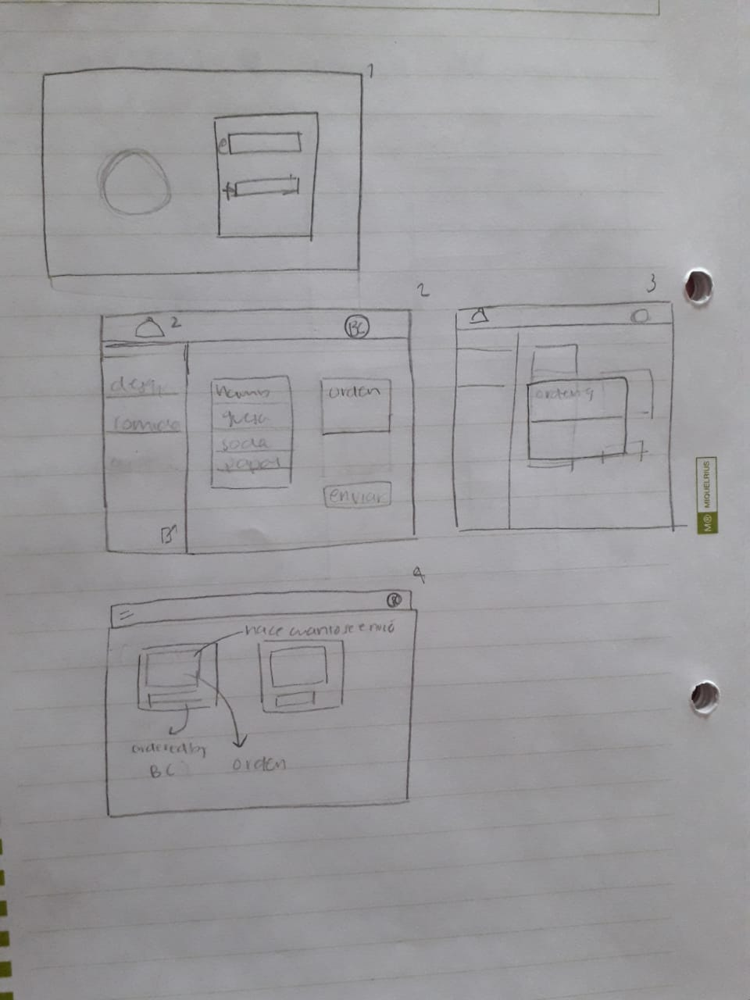
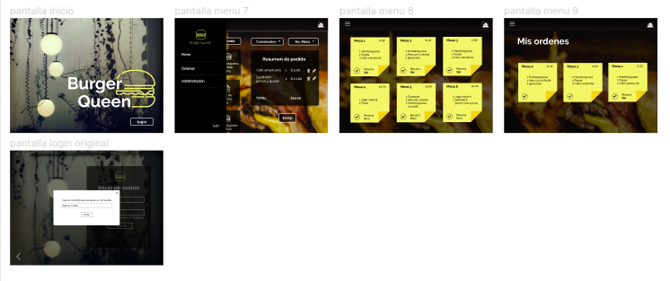

# Burger Queen 

## Resumen del proyecto

Burger Queen es una aplicación que ofrece una alternativa en la forma de tomar pedidos en los restaurantes. Burger queen ofrece tomar nuevas ordenes, editarlas, borrarlas y almacenarlas permitiendo una actualización de la información en tiempo real entre cocina y meseros. 

## Sketch 

Se identificaron y aterrizaron los elementos básicos que debería de llevar la app para posteriormente integrarlos en un prototipo de alta fidelidad.

## Prototipo

Distribuimos los elementos propuestos en el sketch para optimizar la navegación y la experiencia de usuario, hicimos algunas modificaciones con base en el feedback recibido por coaches y compañeras.

## Objetivos de aprendizaje

### HTML y CSS

- [x] HTML semántico
- [x] CSS flexbox
- [ ] Sass
- [x] Maquetación

### Frontend Development

- [x] Componentes
- [x] Manejo del estado

### PWA

- [x] Concepto
- [x] Utilidad
- [ ] Que es [Workbox](https://developers.google.com/web/tools/workbox)
- [x] Qué es un `serviceWorker`

### React

- [x] [`JSX`](https://es.reactjs.org/docs/introducing-jsx.html)
- [x] [Componentes `class` y componentes `function`](https://es.reactjs.org/docs/components-and-props.html#function-and-class-components)
- [x] `props`
- [x] [Manejo de eventos](https://es.reactjs.org/docs/handling-events.html)
- [x] [Listas y keys](https://es.reactjs.org/docs/lists-and-keys.html)
- [x] [Renderizado condicional](https://es.reactjs.org/docs/conditional-rendering.html)
- [x] [Levantamiento de estados](https://es.reactjs.org/docs/lifting-state-up.html)
- [x] [`hooks`](https://es.reactjs.org/docs/hooks-intro.html)
- [ ] [`CSS` modules](https://create-react-app.dev/docs/adding-a-css-modules-stylesheet)
- [x] [React Router](https://reacttraining.com/react-router/web)

### Firebase

- [x] Firestore
- [ ] Firebase security rules
- [x] Observables

### Testing

- [x] Testeo de tus interfaces
- [x] Testeo de componentes
- [ ] Testeo asíncrono
- [ ] Mocking

### Colaboración en Github

- [x] Branches
- [x] Pull Requests
- [ ] Tags

### Organización en Github

- [x] Projects
- [ ] Issues
- [ ] Labels
- [ ] Milestones

### Buenas prácticas de desarrollo

- [x] Modularización
- [x] Nomenclatura / Semántica
- [ ] Linting

---
