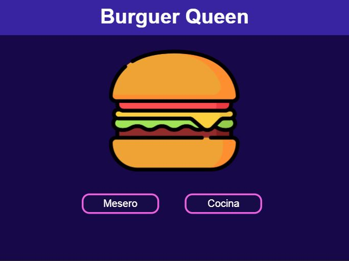
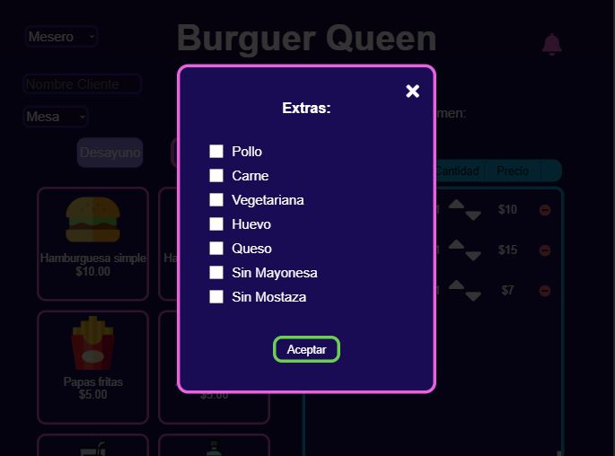
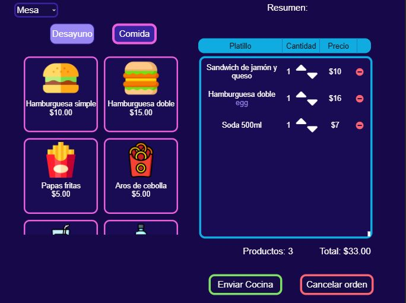
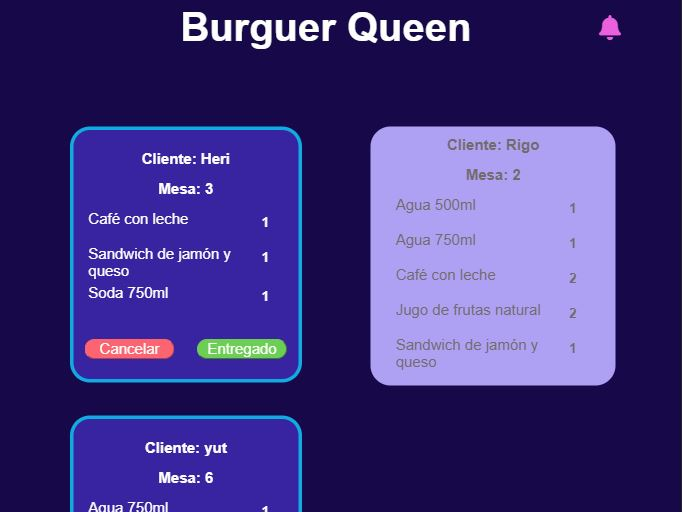
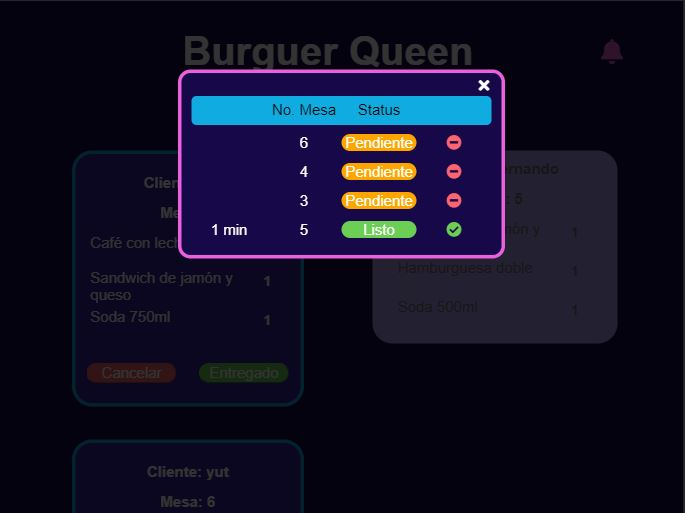

# Burguer Queen

Aplicación creada para un pequeño restaurante de hamburguesas, el cual requiere tomar pedidos usando una tablet y enviarlos a cocina para que se preparen de manera ordenada y eficiente.

Proyecto propuesto por Laboratoria, creado con React, Html5, Sass y como backend, Firebase. Desarrollado por [Lizeth Rivera](https://github.com/LizethRivera04) y [Elizabeth Flores](https://github.com/ElizaFlores11), teniendo como principales retos el aprendizaje de un framework (React), generar una PWA y mantener datos sin conexión.

## Características

- La aplicación fue diseñada para tablet con fines prácticos del restaurant, sin embargo, si usted desea probarla, es posible visualizarla en desktop.
- Como backend usamos Cloud Firestore.
- Es una [Progressive Web App](https://codigofacilito.com/articulos/progressive-apps) auditada con [Lighthouse](https://developers.google.com/web/tools/lighthouse/?hl=es) por lo que es posible usarla offline.
- El testing se realizó usando Testing Library y Jest.

## Funcionalidades

- La interfaz esta divida en dos perfiles : Mesero y Cocina.
- En la interfaz mesero, podemos encontrar dos menus: Desayuno y Comida, una vez seleccionado el platillo, se pueden agregar algunos aditamentos y la cantidad deseada.
- Una vez completado el pedido, el mesero la envía a cocina.
- El cocinero puede visualizar en tiempo real las ordenes pendientes y cambiar su estatus a listo una vez finalizada su preparación o en su defecto, cancelar el pedido.
- Cocinero y mesero pueden visualizar una lista de las ordenes con estatus pendiente y lista con el fin de llevar un control de las ordenes faltantes de entregar por parte de cocina, las ordenes que ya han sido preparadas para entregar al cliente, así como la opción de eliminar de la lista las ordenes entregadas.
- En caso de ser el mesero y estar en modo offline, las ordenes se guardan en caché y se envian a cocina, una vez regresando al modo online las ordenes son enviadas a Firestore.
- En caso de ser el cocinero y estar en modo offline, puede cambiar el estatus de las ordenes y visualizar el cambio en la lista de ordenes, una vez regresando al modo online el estatus es modificado en Firestore.

## Tecnologías usadas
- HTML
- CSS (Grid, Flexbox)
- SASS
- JavaScript
- React JS
- Firebase
- Jest
- Test Library
- Lighthouse

## Nota

Para visualizar el proyecto puedes ingresar al siguiente enlace https://burguerqueen-f6391.web.app/ y probarlo en una tablet, usando el simulador de Chrome o en modo desktop.

En caso de clonar el repositorio, necesitarás tener mínimo Node v.8.10 y npm v.5.6 instalados en tu computadora y ejecutar los siguientes comandos:

##### `npm start`
Ejecuta la aplicación en modo de desarrollo, al abrir http://localhost:3000 podrás visualizarlo en el navegador.

##### `npm test`
Se ejecutarán los test relacionados con los últimos archivos modificados.

##### `npm run build`
Corre este comando cuando estés listo para desplegar la app a producción, se creará una carpeta build que contendrá una compilación optimizada del proyecto

