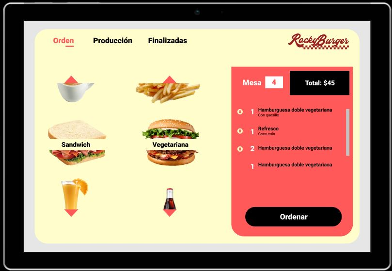
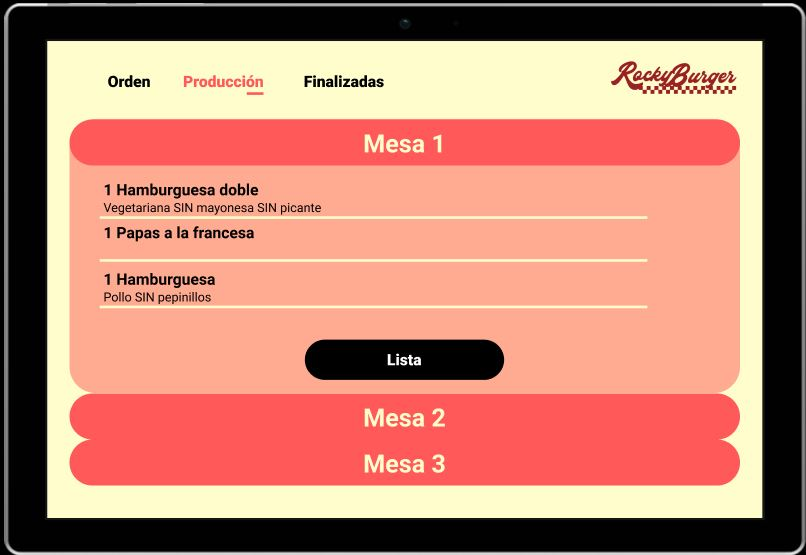
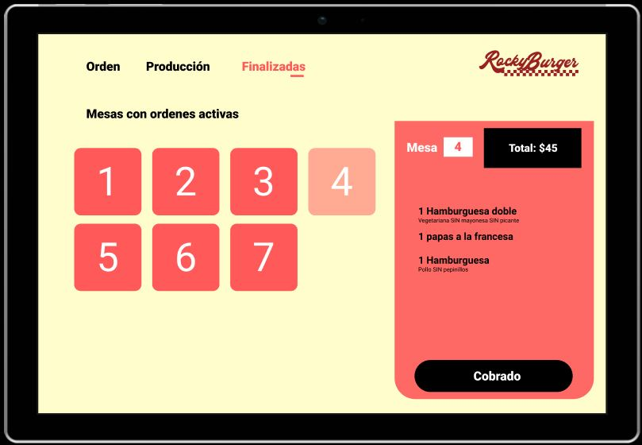
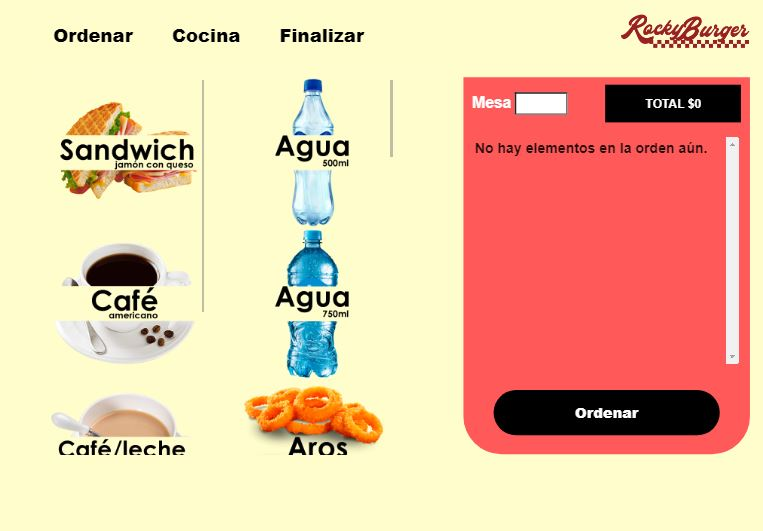
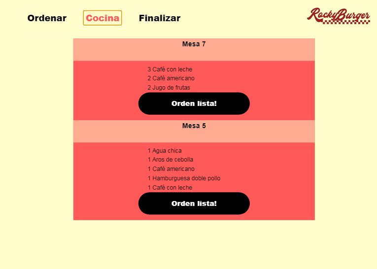

# Burger Queen

## RockyBurger

¿Alguna vez ustedes como clientes en algún establecimiento de comida a ser atendidos se han sentido en la necesidad de volver a repetir su orden o hubo alguna confusión a la hora de recibirla? ¿O si fuéramos meseros y recibiéramos una orden muy extensa y detallada (tomando en cuenta que no es la única)? Seguramente sería un caos.

RockyBurger es una interfaz diseñada para la interacción mesero/cocinero para agilizar la entrega de órdenes en una cadena de comida rápida. La interfaz tiene una carga rápida, visualmente contiene bontones grandes para evitar error al dar click y una forma intuitiva de usarla.

### Historias de usuario

Como primer paso se desarrollaron historias de usuario para comprender de mejor manera las necesidades de los usuarios a los que va dirigido.

H.1. Como mesero debe de poder tomar pedido de cliente.

Yo como meserx quiero tomar el pedido de un cliente para no depender de mi mala memoria, para saber cuánto cobrar, y enviarlo a la cocina para evitar errores y que se puedan ir preparando en orden.

Criterios de aceptación:

-Debe de poder ver los productos de BQ.
-Debe de poder agregar el número de mesa que va a atender.
-Debe de poder agregar los productos.
-Debe de poder eliminar los productos antes de enviar a cocina.
-Debe de tener un menú estático para que cambie de ventana cuando lo desee.
-Debe de poder elegir ingredientes extra para hamburguesa.
-Debe de poder ver el resumen del pedido y el total de la compra.
-Debe de poder enviar el pedido a cocina.

Definición de terminado:

-Debe de haber un prototipo.
-El prototipo recibió feedback y se itero. 
-Debe de tener estilos con sas y es adaptado a tablet.

### Prototipo

#### Vista para tomar orden de cliente

#### Vista para empleados en cocina

#### Vista para entregar orden realizada y concluir venta

### Demo

### HTML y CSS

- [ ] HTML semántico
- [ ] CSS flexbox
- ☑ Sass
- ☑ Maquetación

### Frontend Development

- ☑ Componentes
- ☑ Manejo del estado

### PWA

- [ ] Concepto
- [ ] Utilidad
- [ ] Que es [Workbox](https://developers.google.com/web/tools/workbox)
- [ ] Qué es un `serviceWorker`

### React

- ☑ [`JSX`](https://es.reactjs.org/docs/introducing-jsx.html)
- ☑ [Componentes `class` y componentes `function`](https://es.reactjs.org/docs/components-and-props.html#function-and-class-components)
- ☑ `props`
- ☑ [Manejo de eventos](https://es.reactjs.org/docs/handling-events.html)
- ☑ [Listas y keys](https://es.reactjs.org/docs/lists-and-keys.html)
- ☑ [Renderizado condicional](https://es.reactjs.org/docs/conditional-rendering.html)
- ☑ [Levantamiento de estados](https://es.reactjs.org/docs/lifting-state-up.html)
- ☑ [`hooks`](https://es.reactjs.org/docs/hooks-intro.html)
- [ ] [`CSS` modules](https://create-react-app.dev/docs/adding-a-css-modules-stylesheet)
- ☑ [React Router](https://reacttraining.com/react-router/web)

### Firebase

- ☑ Firestore
- ☑ Firebase security rules
- [ ] Observables

### Testing

- [ ] Testeo de tus interfaces
- [ ] Testeo de componentes
- [ ] Testeo asíncrono
- [ ] Mocking

### Colaboración en Github

- ☑ Branches
- ☑ Pull Requests
- [ ] Tags

### Organización en Github

- ☑ Projects
- ☑ Issues
- ☑ Labels
- ☑ Milestones

### Buenas prácticas de desarrollo

- [ ] Modularización
- [ ] Nomenclatura / Semántica
- [ ] Linting

